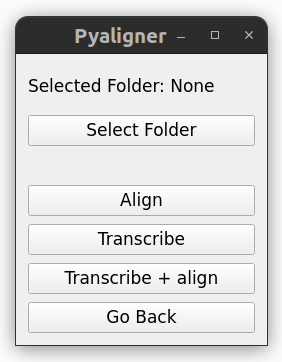

User guide
==========

Before using PyAligner, do not forget to install it as 
explained in the :ref:`installation` section.

.. warning::
   Do not forget to activate the virtual environment before running any 
   command:

   .. code-block:: bash

      mamba activate pyaligner_env

Graphical User Interface
++++++++++++++++++++++++

The graphical user interface (GUI) is the main way to interact with the
software.

.. code-block:: bash

   pyaligner gui

|

All the commands will perform the specified tasks to all the files in the specified 
folder and its subfolders. 

Command Line Interface
++++++++++++++++++++++

Pyaligner offers three main features: transcription, alignment and both 
automatically. You can see all the available commands by running:

.. code-block:: bash

   pyaligner

All the commands will perform the task to all the files in the specified 
folder and its subfolders. 

Transcription
-------------

Automatically transcribe all audio files inside a folder (and nested 
subfolders) into text files:

.. code-block:: bash

   pyaligner transcribe <input_folder>

You can get more information with:

.. code-block:: bash

   pyaligner transcribe --help

Alignment
---------

Automatically align all audio files with their corresponding transcription 
text files:

.. code-block:: bash

   pyaligner align <input_folder> <language>

The language parameter is necessary. Check available 
`dictionaries <https://mfa-models.readthedocs.io/en/latest/dictionary/index.html#dictionary>`_ 
and `acoustic models <https://mfa-models.readthedocs.io/en/latest/acoustic/index.html#acoustic>`_

The input folder must contain audio files and their corresponding transcription 
text files. The transcription text files must have the same name as the 
audio files, but with a different extension.
For example, if you have an audio file called ``audio.wav``, the transcription
file must be called ``audio.txt``. You can get more information with:

.. code-block:: bash

   pyaligner align --help

Transcription and Alignment
---------------------------

Automatically perform both transcription and alignment, including language 
detection:

.. code-block:: bash

   pyaligner auto <input_folder>

The optional parameter ``--language`` can be used to specify the language for 
the alignment. If not specified, the language will be detected automatically.

.. code-block:: bash

   pyaligner auto <input_folder> --language <language>

You can get more information with:

.. code-block:: bash

   pyaligner auto --help

Renaming files
++++++++++++++

As an additional feature, you can rename all the audio files inside a folder 
and its subfolders to match the pattern 
``<folder_name>_<file_number>.<extension>``. For example, if you have a folder
called ``my_folder`` with the following files: ``this_audio.wav``, 
``that_audio.wav``, ``another_audio.wav``, the files will be renamed 
to ``my_folder_00001.wav``, ``my_folder_00002.wav``, 
``my_folder_00003.wav``.

.. code-block:: bash

   pyaligner rename <input_folder>

You can get more information with:

.. code-block:: bash

   pyaligner rename --help